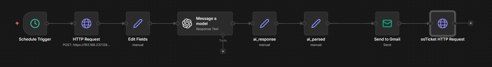

# Workflow Diagram

---

## **Overview**

The workflow diagram represents the full path that a security alert takes as it moves through the automation pipeline inside n8n.

Rather than leaving an alert in its original raw form, the workflow is designed to collect the alert data, extract the most useful fields, enrich the alert with AI-assisted analysis, send a readable notification email, and then create a ticket for formal investigation tracking.

This diagram is important because it shows that the project is not only about detecting suspicious activity, but also about improving what happens after detection by making alerts easier to understand, communicate, and act on.

---

## **Workflow Objective**



The main objective of the workflow is to transform raw detection output into something that is operationally useful for a SOC-style process.

In many lab environments, the workflow stops once a detection rule fires and an alert appears in the SIEM. While that proves a detection works, it does not fully reflect the work that happens in an actual security operations environment where alerts need to be reviewed, communicated, and escalated in a structured way.

This workflow extends beyond simple alert generation by showing how automation can reduce manual effort and move an alert through multiple stages of triage and response preparation.

---

## **Diagram Summary**

The workflow follows a linear sequence in which each node prepares the alert for the next stage of processing.

It begins with a scheduled trigger that initiates the automation at a defined interval, then uses an HTTP request to retrieve alert data from Elasticsearch. After the raw alert data is collected, the workflow reshapes the important fields into a cleaner structure, sends that data to a language model for analysis, parses the returned response, sends an email notification through Gmail, and finally opens a ticket in osTicket.

Together, these steps create a complete alert-handling path that turns technical log data into a readable and trackable incident workflow.

```text
Schedule Trigger
    ↓
HTTP Request
    ↓
Edit Fields
    ↓
Message a model
    ↓
ai_response
    ↓
ai_parsed
    ↓
Send to Gmail
    ↓
osTicket HTTP Request


````

---

## **Why the Diagram Matters**

The workflow diagram matters because it gives a clear visual explanation of how automation is being used to support SOC operations rather than just demonstrate a disconnected set of tools.

It shows the relationship between alert retrieval, data shaping, analysis, communication, and case creation in a way that is easy to follow. This makes the project easier to understand for hiring managers, recruiters, technical reviewers, or anyone else looking at the repository.

It also helps show that the project was designed with operational flow in mind, which is an important difference between a simple tool demo and a more complete security engineering project.

---

## **Schedule Trigger**

The workflow begins with the Schedule Trigger node, which is responsible for starting the automation on a recurring basis.

This step exists so the workflow can periodically check for new alert data without requiring manual execution. Instead of waiting for someone to press a button in n8n each time, the schedule allows the workflow to behave more like a real automated monitoring process that continuously performs its task at regular intervals.

In practical terms, this node acts as the entry point into the pipeline and ensures that the rest of the workflow runs consistently according to the cadence that was configured.

---

## **HTTP Request**

After the workflow is triggered, the HTTP Request node reaches out to Elasticsearch to retrieve alert data from the relevant index.

This is the point where the automation pulls in the raw alert content generated by the SIEM. The returned data may contain a large amount of information, including fields that are useful, fields that are optional, and fields that are too noisy to be directly used in downstream actions like emails or ticket creation.

Because of that, this node is important not only for gathering the alert data, but also for acting as the bridge between the detection platform and the rest of the automation workflow.

---

## **Edit Fields**

Once the raw alert data is retrieved, the Edit Fields node is used to normalize and restructure the most important values.

This step reduces clutter by pulling out the fields that matter most for triage, such as the rule name, hostname, source IP address, username, alert count, and investigation link. Instead of passing a large raw document through the rest of the workflow, this node creates a simplified alert record that is easier to work with and easier to understand.

This is one of the most important parts of the workflow because it changes the alert from something machine-oriented into something that is much more human-readable and reusable in later stages.

---

## **Field Normalization Purpose**

The purpose of field normalization is to make sure that the data being passed forward is consistent, readable, and useful.

Raw alert documents often contain nested structures, inconsistent naming, and extra metadata that may not help an analyst during initial review. By flattening and selecting the key values early in the workflow, the rest of the pipeline becomes cleaner and more reliable.

This also makes the project more realistic from a security engineering perspective because part of the real work in automation is deciding what information should be preserved, what should be simplified, and what can safely be left out.

---

## **Message a Model**

After the important fields are extracted, the normalized alert is sent into the Message a model node for AI-assisted analysis.

This stage gives the workflow the ability to generate a summary or interpretation of the alert rather than only forwarding raw field values. Instead of forcing the analyst to mentally piece together what the alert might mean, this step helps produce a more readable explanation that can support faster review.

The goal here is not to replace analyst judgment, but to make the first pass of alert triage more efficient by turning structured alert data into a concise narrative that gives the analyst immediate context.

---

## **AI-Assisted Analysis**

The AI-assisted analysis stage adds value by helping convert raw technical content into language that is easier to review during triage.

For example, an alert may contain enough raw fields to understand what happened, but it may still take time for a person to interpret the significance of those values. By using a model to summarize the alert and explain the likely meaning of the activity, the workflow improves readability and reduces the friction involved in reviewing repetitive or noisy alerts.

This part of the workflow is especially useful in demonstrating how AI can support security operations in a practical way, not as a gimmick, but as a tool for improving communication around alerts.

---

## **ai_response**

The ai_response stage captures the raw output returned from the model.

At this point, the workflow has received generated analysis, but that response may still need to be separated, cleaned up, or prepared before it can be reused in later nodes. Depending on how the model output is structured, this step may contain the text exactly as it was returned, including sections that need to be parsed or reformatted.

This stage is useful because it preserves the direct result of the AI analysis before any additional processing is applied.

---

## **ai_parsed**

The ai_parsed stage takes the model output and reshapes it into a form that can be inserted into the notification email and ticket body more cleanly.

This step matters because generated responses are often more useful once they are separated into the specific pieces needed by downstream actions. Instead of treating the model output as one unstructured block of text, the parsing stage makes the response easier to embed into a professional-looking alert message or case record.

This improves both readability and consistency, which is important when the final output is going to be reviewed by a human analyst.

---

## **Send to Gmail**

Once the alert fields and AI analysis are ready, the workflow sends a formatted notification email through Gmail.

This stage is responsible for delivering the alert in a way that is easy to consume outside of n8n or Elasticsearch. Rather than requiring someone to log into the SIEM and manually inspect the alert, the workflow pushes the information directly into email so that it can be seen quickly and reviewed in a more accessible format.

The email format also helps present the alert more clearly by organizing the key fields and analysis into a structured message that is easier to scan than the original raw JSON or SIEM document.

---

## **Email Alerting Purpose**

The purpose of the Gmail stage is to improve visibility and communication around alerts.

A raw detection may technically exist in the SIEM, but that alone does not guarantee it will be seen promptly or understood easily. By turning the alert into a clean email notification, the workflow creates an output that is more usable for quick triage and easier to share in a standard communication channel.

This step also helps demonstrate how the workflow supports a more complete operational process by making sure the alert is not just generated, but also delivered in a readable and actionable form.

---

## **osTicket HTTP Request**

After the email is sent, the final major stage in the workflow is the HTTP request to osTicket.

This node submits the alert data to the ticketing system so that a formal case can be created for investigation tracking. Instead of allowing the alert to remain only as an email or SIEM event, this stage gives it a place within a structured case management process where it can be documented, reviewed, and followed through.

That is what makes this final step so important. It moves the workflow beyond simple notification and into actual incident tracking.

---

## **Ticket Creation Purpose**

The purpose of ticket creation is to create accountability and structure around alert handling.

In a real security operations environment, alerts usually need to be tracked so that there is a record of what happened, what was reviewed, and what actions were taken. A ticketing system helps provide that structure by turning an alert into a documented case rather than a one-time notification.

This stage makes the project stronger because it shows that the workflow was designed with operational follow-through in mind, not just alert generation and delivery.

---

## **End-to-End Flow**

Taken as a whole, the workflow shows how a single detection can move through multiple meaningful stages of processing.

It starts as raw alert data in Elasticsearch, becomes normalized and easier to read, gains AI-generated context, gets delivered through email, and is finally recorded in a ticketing system for investigation. Each stage adds a practical improvement that makes the alert more useful to a human analyst.

That end-to-end design is what gives the project substance. It demonstrates not just that individual tools were connected, but that they were connected for a clear operational purpose.

---

## **Security Engineering Value**

From a security engineering perspective, the workflow diagram shows how automation can reduce manual work while improving consistency in the alert-handling process.

Instead of expecting an analyst to manually retrieve alert details, summarize the meaning, send a notification, and open a case, the workflow handles those repetitive steps automatically. This reduces friction, preserves important context, and creates a more repeatable process that can scale better than manual handling alone.

That makes the workflow diagram more than a visual summary. It becomes a representation of how engineering decisions can improve day-to-day security operations.

---

## **What the Diagram Communicates to Reviewers**

For someone reviewing the repository, the workflow diagram quickly explains what the project does and why it matters.

It helps the reader understand that this is not just an n8n experiment or a generic automation example. It is a workflow designed to support a SOC-style process by improving how alerts are prepared, analyzed, communicated, and tracked.

That matters in a portfolio setting because it shows intention. It tells the reviewer that the project was built to solve a real operational problem, not just to connect tools for the sake of saying they were connected.

---

## **Documentation Goal**

The goal of this workflow diagram file is to explain the logic behind the automation in a way that is easy to follow and grounded in actual SOC workflow needs.

It is meant to help the reader understand how the pipeline operates from start to finish, what each stage contributes, and why the sequence of nodes matters to the overall design.

Together, the diagram and its explanation turn the workflow from a visual flowchart into a clear representation of how detection output is transformed into an actionable response process.
