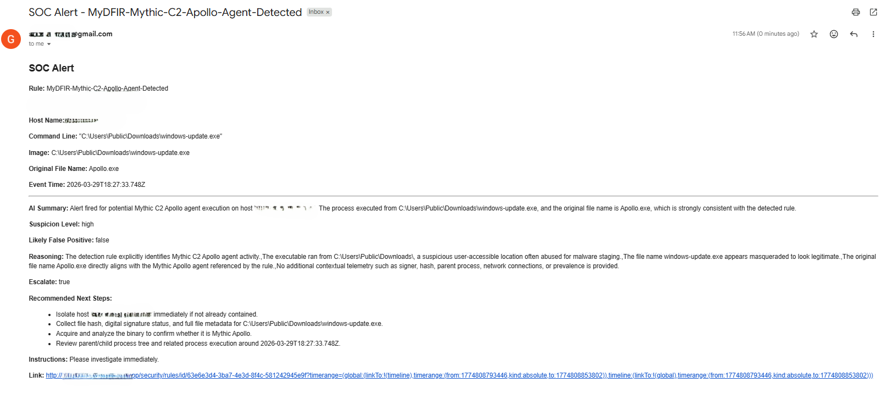

# Gmail Alerting

---

## **Overview**

The Gmail alerting stage is responsible for delivering alert notifications in a readable and accessible format.

Once the alert has been normalized and analyzed, this stage formats the data into an email and sends it to a designated inbox. This ensures that alerts can be quickly reviewed without requiring direct access to the SIEM or automation platform.

This step improves visibility and makes it easier to respond to alerts in a timely manner.

---

## **Purpose**

The purpose of Gmail alerting is to communicate alerts clearly and efficiently.

While alerts exist within the SIEM, they may not always be immediately visible or easy to interpret. By sending an email, the workflow ensures that the alert reaches the analyst in a format that is easy to read and act upon.

This stage bridges the gap between detection and communication.

---

## **Role in the Workflow**

Gmail alerting occurs after the alert has been enriched with AI analysis and before ticket creation.

At this point, all necessary information has been prepared, and the workflow focuses on delivering that information in a user-friendly format.

This makes the alert accessible before it is formally tracked in the ticketing system.

---

## **Email Formatting**

The email is structured to present the most important alert details clearly.

It typically includes the rule name, host name, source IP, username, event count, investigation link, and the AI-generated analysis. The formatting is designed to be easy to scan, allowing the analyst to quickly understand the alert.

This structure ensures that the email is both informative and readable.

---

## **HTML Email Structure**

The workflow uses HTML formatting to improve the appearance of the email.

This allows sections to be clearly separated, important fields to be highlighted, and the overall layout to be more professional. Compared to plain text, HTML emails provide better readability and organization.

This enhances the usability of the alert notification.

---

## **Improving Alert Visibility**

Email alerting improves visibility by delivering alerts directly to a commonly used communication channel.

Instead of requiring analysts to continuously monitor a dashboard, alerts are pushed to them as they occur. This makes it easier to stay aware of new activity and respond quickly.

This is especially useful in environments where immediate awareness is important.

---

## **Reducing Time to Triage**

By presenting the alert in a clear and structured format, the email reduces the time required for initial triage.

The analyst does not need to search for relevant fields or interpret raw data, as the key information is already organized and explained. This allows for faster decision-making and more efficient handling of alerts.

This time savings becomes significant when dealing with large volumes of alerts.

---

## **Integration with Workflow**

The Gmail stage is tightly integrated with the rest of the workflow.

It uses the normalized fields and AI-generated analysis to construct the email, ensuring that all information is consistent with what is later used in ticket creation. This keeps the workflow aligned and prevents discrepancies between different outputs.

This integration reinforces the overall consistency of the pipeline.

---

## **Operational Value**

From an operational perspective, Gmail alerting improves both communication and responsiveness.

It ensures that alerts are not only generated, but also delivered in a way that encourages timely review. This helps reduce delays in response and improves the overall effectiveness of the SOC process.

This stage plays a key role in connecting detection to action.

---

## **Security Engineering Perspective**

From a security engineering perspective, email alerting demonstrates how automation can improve the delivery of critical information.

It shows that detection alone is not enough, and that the way alerts are communicated can significantly impact how they are handled.

By automating this process, the workflow ensures that alerts are consistently delivered in a clear and actionable format.

---

## **Documentation Goal**

The goal of this document is to explain how alert data is transformed into a structured email notification and why this step is important in the workflow.

It highlights how formatting, delivery, and integration contribute to making alerts more accessible and easier to act upon.

Together, this section demonstrates how communication plays a critical role in effective security operations.
