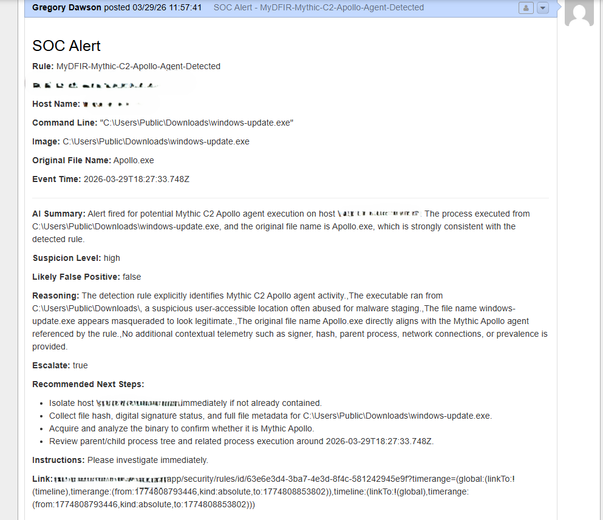

# Ticket Creation

---

## **Overview**

The ticket creation stage is responsible for converting an alert into a structured case within the ticketing system.

By the time the workflow reaches this stage, the alert has already been normalized and enriched with AI-generated analysis. This step takes that prepared data and submits it to osTicket, where it becomes a trackable record that can be reviewed and investigated.

This stage is what transitions the workflow from simple alert notification into a formal incident tracking process.

---

## **Purpose**

The purpose of ticket creation is to ensure that alerts are not only seen, but also tracked and followed through.

In a real SOC environment, alerts are rarely handled as one-off events. They are typically logged as cases so that there is a record of what happened, what actions were taken, and how the issue was resolved.

This stage introduces that structure into the workflow by turning each alert into a documented case.

---

## **Role in the Workflow**

Ticket creation occurs after the alert has been sent via email.

At this point, the alert has already been made visible to the analyst, and the workflow now ensures that it is also recorded in a system designed for investigation and tracking.

This makes the workflow more complete by covering both communication and case management.

---

## **osTicket Integration**

The workflow integrates with osTicket using an HTTP request node.

This node sends a POST request to the osTicket API endpoint, which creates a new ticket using the provided alert data. The integration relies on properly formatted payloads and authentication to ensure that tickets are created successfully.

This allows the automation pipeline to interact directly with the ticketing system without requiring manual input.

---

## **Ticket Payload Structure**

The ticket payload contains the key fields extracted and generated earlier in the workflow.

These typically include the alert rule name, host name, source IP, username, event count, investigation link, and the AI-generated analysis. The payload is structured in a way that aligns with osTicket’s expected input format.

By standardizing this structure, the workflow ensures that all tickets contain consistent and useful information.

---

## **Example Ticket Content**

The resulting ticket presents the alert in a clear and organized format.

It includes both the structured alert fields and the AI-generated explanation, allowing the analyst to quickly understand what happened and begin investigation without needing to reference multiple systems.

This makes the ticket a central source of information for the alert.

---

## **Consistency and Reliability**

Because the ticket is generated from normalized data, the structure of each ticket remains consistent across all alerts.

This consistency is important for maintaining an organized ticket queue and ensuring that no critical information is missing. It also makes it easier to review and compare tickets over time.

Reliability at this stage is critical, as missing or malformed tickets could lead to gaps in tracking.

---

## **Error Handling Considerations**

The workflow must account for potential issues when creating tickets.

This includes handling failed API requests, ensuring required fields are present, and verifying that the ticketing system is reachable. Proper error handling ensures that alerts are not lost if the ticket creation step encounters a problem.

In a production environment, this might also include retry logic or logging failed requests for later review.

---

## **Operational Value**

From an operational standpoint, ticket creation adds accountability to the alert handling process.

It ensures that every alert has a corresponding record that can be tracked, assigned, and resolved. This is essential for maintaining visibility into ongoing investigations and ensuring that no alerts are overlooked.

This stage helps move the workflow from reactive notification to structured incident management.

---

## **Security Engineering Perspective**

From a security engineering perspective, ticket creation demonstrates how automation can enforce process consistency.

By automatically creating tickets for each alert, the workflow ensures that all events are documented in a uniform way. This reduces reliance on manual processes and helps maintain a reliable record of activity.

This reflects real-world practices where automation is used to improve both efficiency and accountability.

---

## **Documentation Goal**

The goal of this document is to explain how alerts are converted into structured tickets and why this step is important for a complete SOC workflow.

It highlights how the integration with osTicket works, how data is formatted, and how this stage supports investigation and tracking.

Together, this section shows how the workflow extends beyond alert generation into full incident lifecycle management.

---
